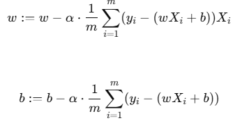

Linear Regression with Gradient Descent (from Scratch) in python

Overview

The aim of the project implementation is without using built-in machine learning libraries like Scikit-Learn. The goal is to understand the mathematical foundation behind linear regression and optimization techniques.

Features

Implements Batch Gradient Descent for Linear Regression

Supports Mean Squared Error (MSE) as the loss function

Allows learning rate and number of iterations customization

Implementation

The hypothesis function for Linear Regression is:

y = wx+b

where:

w is the weight (coefficient)

b is the bias (intercept)

x is the input feature

y is the predicted output

Gradient Descent Algorithm

We optimize the parameters (w, b) using Gradient Descent, updating them iteratively:

where:

 alpha is the learning rate

 m is the number of training examples

The gradients help minimize the Mean Squared Error (MSE) loss function.